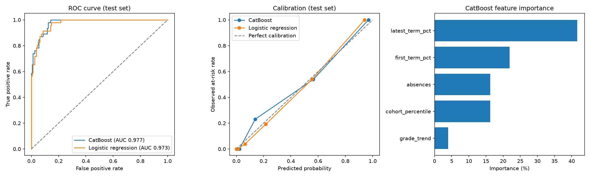

# CatBoost At-Risk Model — Evaluation Report

Generated: 2026-10-01 01:17 UTC

## Data

- Source: UCI Student Performance (Cortez & Silva, 2008), mathematics and
  Portuguese classes, two Portuguese secondary schools.
- Records: 1044 (662 unique students)
- Target: `at_risk` = final grade below 10/20
  (22.0% of records)
- Train: 835 records, test: 209 records. The split is
  grouped by student, so no student appears in both sets.

## Features

| Feature | Dashboard source |
|---|---|
| `first_term_pct` | Assessment percentage, first period |
| `latest_term_pct` | Assessment percentage, latest period |
| `grade_trend` | latest − first |
| `cohort_percentile` | CohortPercentile.percentile_rank |
| `absences` | Attendance records with status Absent |

## Cross-validation (training set, 5 grouped folds, mean ± std)

| Model | roc_auc | pr_auc | accuracy | precision | recall | f1 | brier_score | log_loss |
|---|---|---|---|---|---|---|---|---|
| CatBoost | 0.968 ± 0.012 | 0.910 ± 0.032 | 0.920 ± 0.020 | 0.849 ± 0.064 | 0.777 ± 0.038 | 0.811 ± 0.046 | 0.058 ± 0.012 | 0.187 ± 0.045 |
| Logistic regression (baseline) | 0.974 ± 0.012 | 0.927 ± 0.032 | 0.932 ± 0.016 | 0.888 ± 0.063 | 0.793 ± 0.029 | 0.837 ± 0.037 | 0.052 ± 0.010 | 0.167 ± 0.028 |

## Held-out test set

| Model | roc_auc | pr_auc | accuracy | precision | recall | f1 | brier_score | log_loss |
|---|---|---|---|---|---|---|---|---|
| CatBoost | 0.977 | 0.931 | 0.919 | 0.854 | 0.761 | 0.805 | 0.052 | 0.160 |
| Logistic regression (baseline) | 0.973 | 0.920 | 0.914 | 0.850 | 0.739 | 0.791 | 0.056 | 0.175 |

Decision threshold for accuracy, precision, recall and F1: 0.5

### CatBoost confusion matrix (test set)

| | Predicted not at risk | Predicted at risk |
|---|---|---|
| Actually not at risk | 157 | 6 |
| Actually at risk | 11 | 35 |

## Feature importance

- `latest_term_pct`: 41.6%
- `first_term_pct`: 21.9%
- `absences`: 16.2%
- `cohort_percentile`: 16.2%
- `grade_trend`: 4.0%

## Limitations

- The data comes from two Portuguese schools (2005–2006) and is graded out
  of 20. The dashboard converts all marks to percentages, but the model has
  not been validated on Kenyan school data.
- `absences` in the source data is counted over the whole school year.
  Early in a term the dashboard will see fewer absences than the model was
  trained on, which may understate risk.
- Behaviour records and teacher observations are not in the training data.
  They are used by the expert rules, not by this model.
- The model predicts the probability of failing the final assessment. It is
  a support signal for teachers and parents, not a judgement of the student.
